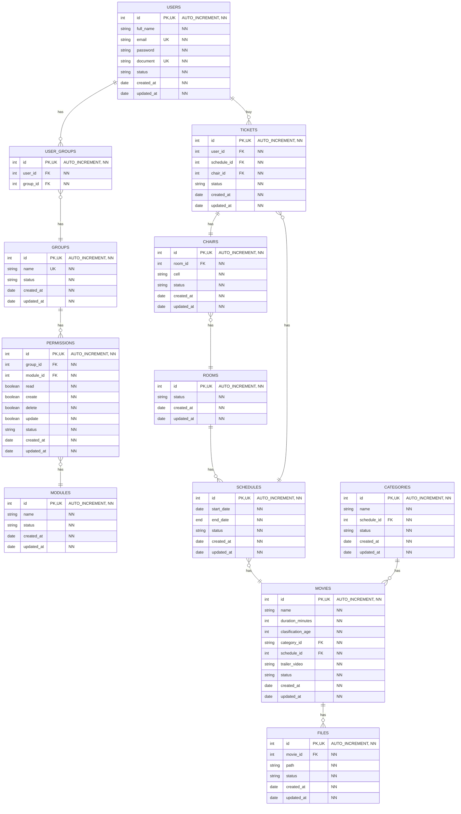

# Diagrama entidad-relación

```mermaid
    erDiagram

        USERS {
            int id PK, UK "AUTO_INCREMENT, NN"
            string full_name "NN"
            string email UK "NN"
            string password "NN"
            string document UK "NN"
            string status "NN"
            date created_at "NN"
            date updated_at "NN"
        }

        USER_GROUPS {
            int id PK, UK "AUTO_INCREMENT, NN"
            int user_id FK "NN"
            int group_id FK "NN"
        }

        GROUPS {
            int id PK, UK "AUTO_INCREMENT, NN"
            string name UK "NN"
            string status "NN"
            date created_at "NN"
            date updated_at "NN"
        }

        PERMISSIONS {
            int id PK, UK "AUTO_INCREMENT, NN"
            int group_id FK "NN"
            int module_id FK "NN"
            boolean read "NN"
            boolean create "NN"
            boolean delete "NN"
            boolean update "NN"
            string status "NN"
            date created_at "NN"
            date updated_at "NN"
        }

        MODULES {
            int id PK, UK "AUTO_INCREMENT, NN"
            string name "NN"
            string status "NN"
            date created_at "NN"
            date updated_at "NN"
        }

        TICKETS {
            int id PK, UK "AUTO_INCREMENT, NN"
            int user_id FK "NN"
            int schedule_id FK "NN"
            int chair_id FK "NN"
            string status "NN"
            date created_at "NN"
            date updated_at "NN"
        }

        CHAIRS {
            int id PK, UK "AUTO_INCREMENT, NN"
            int room_id FK "NN"
            string cell "NN"
            string status "NN"
            date created_at "NN"
            date updated_at "NN"
        }

        ROOMS {
            int id PK, UK "AUTO_INCREMENT, NN"
            string status "NN"
            date created_at "NN"
            date updated_at "NN"
        }

        SCHEDULES {
            int id PK, UK "AUTO_INCREMENT, NN"
            date start_date "NN"
            end end_date "NN"
            string status "NN"
            date created_at "NN"
            date updated_at "NN"
        }

        CATEGORIES {
            int id PK, UK "AUTO_INCREMENT, NN"
            string name "NN"
            int schedule_id FK "NN"
            string status "NN"
            date created_at "NN"
            date updated_at "NN"
        }

        MOVIES {
            int id PK, UK "AUTO_INCREMENT, NN"
            string name "NN"
            int duration_minutes "NN"
            int clasification_age "NN"
            string category_id FK "NN"
            int schedule_id FK "NN"
            string trailer_video "NN"
            string status "NN"
            date created_at "NN"
            date updated_at "NN"
        }

        FILES {
            int id PK, UK "AUTO_INCREMENT, NN"
            int movie_id FK "NN"
            string path "NN"
            string status "NN"
            date created_at "NN"
            date updated_at "NN"
        }


        USERS ||--o{ USER_GROUPS : has
        USER_GROUPS }o --|| GROUPS : has
        GROUPS ||--o{ PERMISSIONS : has
        PERMISSIONS }o--|| MODULES : has
        ROOMS ||--o{ SCHEDULES : has
        TICKETS }o--|| SCHEDULES : has
        TICKETS ||--|| CHAIRS : has
        CHAIRS }o--|| ROOMS : has
        USERS ||--o{ TICKETS : buy
        SCHEDULES }o--|| MOVIES : has
        CATEGORIES ||--o{ MOVIES : has
        MOVIES ||--o{ FILES : has
```
